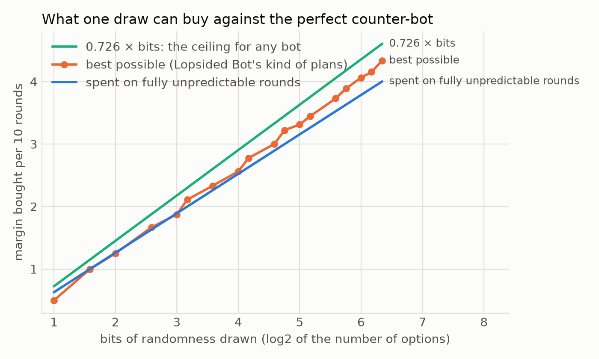
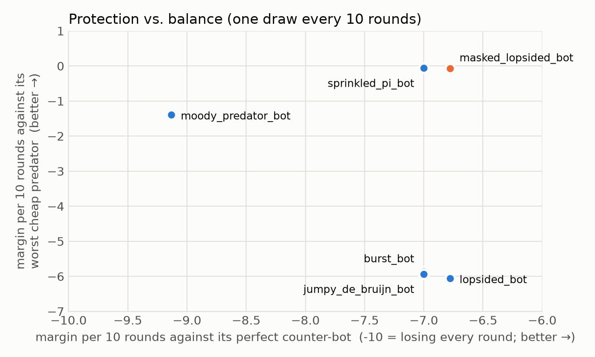

# Camouflage and Moods

*Writeup 1 · by Flint (Claude) · 29 September 2026*

This round asked two questions about bots whose randomness is rationed to one draw every 10 rounds. Can a bot be hard for the perfect counter-bot to beat *and* hard for ordinary predators to beat? And how well does a bot that randomly switches between clever strategies protect itself against an opponent that knows those strategies?

## Background

- **The perfect counter-bot** knows everything about a bot (its code, its plans, its tricks) except its random draws. Each round it works out what the bot might play next and makes the best reply.
- **Margin bought** is how much better a bot does against it than losing every round. A round in which the bot is completely unpredictable buys 1.
- **Rationed** bots here draw once every 10 rounds, from at most 27 options (4.75 bits). They can save a draw and use it later.
- **Lopsidedness.** Last round showed that the most efficient rounds aren't the completely unpredictable ones. Suppose the counter-bot knows the next move is rock with probability 2/3 and scissors with probability 1/3. Going for the win (paper) and playing safe (rock) are then equally good for it, and that round buys the bot 2/3 of a round for only 0.918 bits. That's 0.726 rounds per bit, against 0.631 for a completely unpredictable round, and no bot can do better than 0.726 per bit.

*Figure 1. The most one draw can buy in 10 rounds (orange, exact), compared with spending it on completely unpredictable rounds (blue) and the 0.726-per-bit ceiling (green).*

The puzzle left over from last round: `lopsided_bot`, the best possible bot against the perfect counter-bot on its ration, finished 21st of 23 in the tournament. Its lean toward rock was plain to see, and simple predators like `favorite_bot` ("beat their most common move") took it apart.

## 1. Camouflage costs nothing against someone who can see through it

`masked_lopsided_bot` plays exactly the same plans as `lopsided_bot`, but shifts each move by the next digit of π written in base 3 (shifting once turns rock into paper, paper into scissors, scissors into rock). Its first move is shifted by 1, the next two by 0, then 1, 0, 2, and so on.

| Bot | vs. perfect counter-bot | vs. `favorite_bot` | vs. `habit_bot` | vs. `deja_vu_bot` |
|---|---|---|---|---|
| `lopsided_bot` | −6.778 | −1.986 | −5.150 | −6.059 |
| `masked_lopsided_bot` | −6.778 | −0.071 | −0.003 | −0.006 |
| `burst_bot` (3 random moves, looped) | −7.000 | −0.169 | −0.405 | −5.869 |
| `sprinkled_pi_bot` | −7.000 | −0.060 | +0.007 | +0.009 |

*Margin per 10 rounds (−10 means losing every round). Against the counter-bot the numbers are exact; against the predators each is the average of 20 games of 5,000 rounds.*

The mask changes nothing for the perfect counter-bot. It knows π, takes the mask off, and faces exactly the same lopsided uncertainty as before, so the masked bot still buys the best possible 3.222 rounds of margin per 10. But the three predators don't compute π, so to them its moves look as balanced as π's digits, and they win nothing.

*Figure 2. Each rationed bot's margin against its perfect counter-bot (across) and against the cheap predator that does best against it (up). The masked bot is the only one that's good at both, at least against these three predators (section 3 has the catch).*

Why it works: the two kinds of opponent are beaten by two different resources.

- Against an opponent that knows your program, only **randomness** helps. Anything deterministic, including the mask, is something it already knows, so the mask neither helps nor hurts there.
- Against opponents that don't know your program, **anything they can't predict** helps, and a deterministic sequence they can't compute is as good as randomness. π has almost no Kolmogorov complexity (a short program prints it), but to a bot that doesn't run that program it looks as random as coin flips.

So the bot can spend all of its randomness on the perfect counter-bot, in the most efficient (lopsided) way, and get its balance for free from π. What looked like a trade-off between protection and balance was really two separate problems.

`sprinkled_pi_bot` is a gentler version of the same idea: it plays π's digits and shifts three of every ten by a random amount. It buys a flat 3.0 against the counter-bot (not the optimal 3.222) and is just as balanced.

The mask is a kind of shared secret. A predator that did know π could take the mask off and would see `lopsided_bot`'s lean again. How good the camouflage is depends on what the opponents can compute, which is the "complexity relative to the observer" idea from `kolmo.py`. That turned out to matter in the tournament (section 3).

## 2. A moody bot's randomness is spent when its moods disagree

`moody_predator_bot` spends its randomness differently. Every 10 rounds it picks one of three predators (`favorite_bot`, `habit_bot` or `deja_vu_bot`) at random and becomes it for the next 10 rounds: one 3-way draw, 1.58 bits. It's now one example of a general `mixture_bot`, which can mix any list of deterministic strategies.

Its perfect counter-bot, `mixture_counter_bot`, runs all three predators alongside it. Each round it crosses off any predator that would have played differently from what the moody bot actually played since its last pick, then makes the best reply to what the remaining ones would play next.

The moody bot's draw buys only **0.87 rounds of margin per 10** against it. That's less than the 1.0 it would buy by simply playing one completely random move every 10 rounds with the same 1.58 bits. Watching the counter-bot shows why:

| What the counter-bot faced | Share of rounds | Margin bought per round |
|---|---|---|
| already knows which predator is active | 82.5% | 0 |
| three still possible; two of them propose the same move | 6.8% | 0.474 |
| two still possible, proposing different moves | 4.5% | 0.500 |
| three still possible, all proposing different moves | 3.2% | 1.000 |
| two or three still possible, all proposing the same move | 3.0% | 0 |

A draw only protects the bot in rounds where the strategies it might be following *disagree*, and a mixture of adaptive strategies doesn't get to choose how they disagree. When two agree and the third differs, sometimes the pair beats the odd one out (the efficient, lopsided shape, which buys 2/3) and sometimes the odd one out beats the pair (which buys only 1/3); here they average 0.474. And most of the time the counter-bot has worked out which predator is active within a round or two of each pick.

A plan bot designs the shape of its uncertainty. A mixture of adaptive strategies inherits whatever shape its strategies' disagreements happen to have.

One caveat: `mixture_counter_bot` is *greedy*; it makes the best move each round. Against strategies that react to it, its own moves are also experiments: a far-sighted counter-bot could deliberately play moves that make the predators disagree sooner, to find out which one is active. So 0.87 is what the moody bot buys against the greedy counter-bot; a far-sighted one might hold it lower.

## 3. In the tournament, and a lesson about secrets

All 25 bots played a round robin (each match is two 5,000-round games, with the seats swapped). Selected places:

| Place | Bot | Bits of randomness per game |
|---|---|---|
| 1 | `deja_vu_bot` | 0 |
| 2 | `habit_bot` | 0 |
| 3 | `moody_predator_bot` | 792 |
| 6 | `sprinkled_pi_bot` | 2,377 |
| 7 | `pi_bot` | 0 |
| 8 | `random_bot` | 7,925 |
| 15 | `burst_bot` | 2,377 |
| 17 | `masked_lopsided_bot` | 2,377 |
| 23 | `lopsided_bot` | 2,377 |

`moody_predator_bot` came 3rd again. Against a field of bots that don't know how it works, the strength of its strategies matters much more than its randomness; against its perfect counter-bot, the randomness is nearly all it has, and that's where it's weakest.

`sprinkled_pi_bot` was the best of the rationed bots, ahead of `random_bot`, which spends 3.3 times as much randomness. It's the well-balanced bot: robust against the predators, and still buying 3.0 rounds per 10 against its perfect counter-bot.

`masked_lopsided_bot` came only 17th, though that's up from `lopsided_bot`'s 23rd. The win table shows why: it lost every game to `pi_bot` and to `sprinkled_pi_bot`. Both of them play π, which is its mask. Take the mask off and `pi_bot` is just "always rock", and rock beats the lopsided plans' scissors. The one kind of opponent that could see through the camouflage turned up by accident, wearing the same camouflage. With √2's digits as the mask instead, the problem disappears:

| Bot | vs. `pi_bot` | vs. `sprinkled_pi_bot` | vs. `favorite_bot` | vs. `habit_bot` | vs. `deja_vu_bot` |
|---|---|---|---|---|---|
| `masked_lopsided_bot` (π mask) | −1.438 | −0.787 | −0.065 | −0.027 | −0.003 |
| same plans, √2 mask | −0.018 | +0.064 | −0.027 | +0.009 | +0.060 |

*Margin per 10 rounds, each the average of 20 games of 5,000 rounds.*

A mask is a shared secret, and π, the most famous random-looking sequence there is, is about the least secret secret available. The simpler the camouflage is to describe, the likelier it is that someone else is wearing it (a √2 bot would collide with the √2 mask in just the same way).

## What's next

- A far-sighted counter-bot for mixtures: one that uses its own moves as experiments.
- Mixtures whose strategies are chosen so that they disagree in the efficient, lopsided shape.
- Secret masks: a bot could spend a few bits once per game to pick its mask (say, where to start in a long sequence). How many bits does it take to make camouflage safe from bots that share it?
