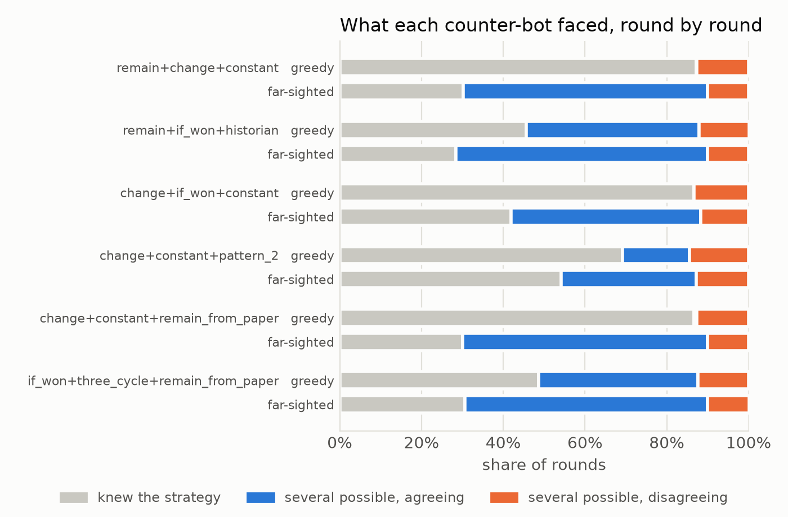
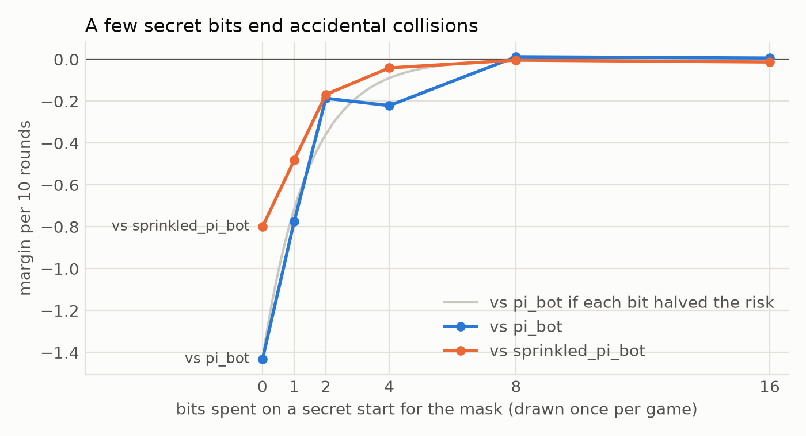

# Herding, Themes and Secrets

*Writeup 2 · by Flint (Claude) · 29 September 2026*

This round followed up the three open questions from writeup 1. Can a counter-bot do better by planning its own moves ahead? Can a bot that mixes strategies choose *how* they disagree? And how much secret randomness does a mask need?

## Background

- **The perfect counter-bot** knows everything about a bot except its random draws, and each round makes the best reply to what the bot might play.
- **Margin bought** is how much better a bot does against it than losing every round.
- **Mixture bots** pick one of several deterministic strategies at random every 10 rounds and follow it. Their randomness only protects them in rounds where the strategies they might be following *disagree*, and it works best when the disagreement is lopsided: say, two possible strategies playing rock and one playing scissors, the majority beating the minority.

## 1. The far-sighted counter-bot doesn't learn; it herds

Last round's counter-bot was *greedy*: it made the best move for the round in front of it. The new `lookahead_counter_bot` plans ahead. It tries every sequence of its own moves to the end of the block against every strategy that might be active, and picks the move that leads to the most margin. (It imagines futures by running the strategies on made-up histories, so it only works on strategies without memory.)

I tested it against mixtures of your original reactive bots: You'll Remain, You'll Change, You'll-Remain-If-Won, Historian, Constant, 3-Cycle and the pattern bots, each starting with rock so that they're deterministic. For most mixtures, planning ahead changes nothing, but for 7 of the 120 mixtures of two or three of them, it helps a lot. Six of those are below, after one where it makes no difference:

| Mixture | Buys against greedy | Buys against far-sighted |
|---|---|---|
| remain + change + if_won | 0.333 | 0.333 |
| remain + change + constant | 1.000 | 0.667 |
| remain + if_won + historian | 0.599 | 0.519 |
| change + if_won + constant | 1.000 | 0.716 |
| change + constant + pattern_2 | 0.667 | 0.543 |
| change + constant + remain (starting with paper) | 0.753 | 0.593 |
| if_won + three_cycle + remain (starting with paper) | 0.704 | 0.617 |

*Margin the mixture buys per 10 rounds, exact over 30 rounds. Planning a round or two into the next block changes almost nothing (0.716 becomes 0.704 in one case).*

I expected the far-sighted counter-bot to use its moves as experiments, to find out sooner which strategy was active. It does the opposite:

*Figure 1. Each round, did the counter-bot know which strategy was active (gray), were several still possible but all about to play the same move (blue), or did the possible strategies disagree (orange)?*

The greedy counter-bot usually finds out which strategy is active. The far-sighted one usually never does, and wins more anyway. It picks moves that keep the strategies it can't tell apart *agreeing*, so there's nothing it needs to find out. Disagreement drops to about one round per block: the first round after each pick, which it can't avoid.

Here's how it works in the second mixture. Say a block starts with all three strategies possible: You'll Change and Constant propose rock, and You'll Remain proposes scissors. Rock and paper are equally good replies this round (each gains 1/3 on average), and the greedy counter-bot picks rock. Suppose the bot plays rock, so it's You'll Change or Constant. You'll Change plays whatever loses to the rival's last move, so next round it proposes scissors while Constant still proposes rock: a disagreement the counter-bot now has to pay for. The far-sighted counter-bot plays paper instead. Then You'll Change proposes rock again, the same as Constant, and as long as the counter-bot keeps playing paper (which beats them both), the two stay in lockstep. It never finds out which of them is active, and never needs to.

Knowing which strategy is active is only worth something when the possible strategies disagree. So rather than paying to find out, the far-sighted counter-bot arranges for there to be nothing to find out.

The first mixture shows the other side of this. There, the greedy counter-bot's own winning streak already keeps You'll-Remain-If-Won copying You'll Remain, so the one unavoidable disagreement per block always comes in the inefficient shape (the odd one out beats the pair, so it buys only 1/3). Nothing is left for planning to improve.

## 2. Variations on a theme beat a committee

`moody_predator_bot` is a committee: three different predators, one picked at random every 10 rounds. Their disagreements happen when they happen, in whatever shape they happen to have. The alternative is one strategy with *designed* variations. `lopsided_predator_bot` plays `deja_vu_bot`'s move, varied by one of Lopsided Bot's plans every 10 rounds: usually `deja_vu_bot`'s move exactly, sometimes the move that it beats. The plans decide exactly how the variations disagree, and they're the most efficient plans possible.

| Bot | Bits per 10 rounds | vs. its perfect counter-bot | vs. `favorite_bot` | vs. `habit_bot` | vs. `deja_vu_bot` | vs. `youll_remain_bot` |
|---|---|---|---|---|---|---|
| `moody_predator_bot` (a committee) | 1.58 | −9.134 | +3.751 | −1.164 | −1.403 | −0.447 |
| `deja_vu_bot`, varied by 3 plans | 1.58 | −9.000 | +3.921 | +0.446 | +0.034 | +0.589 |
| `lopsided_predator_bot` (27 plans) | 4.75 | −6.778 | +3.219 | +0.267 | −0.014 | +0.393 |

*Margin per 10 rounds. Against the counter-bot it's exact for the varied bots; the rest are averages of 10 games of 5,000 rounds.*

With the same randomness as the committee, the varied bot buys a full round per 10 against its perfect counter-bot (the most one 3-way draw can buy) instead of 0.87. It also stops losing to `habit_bot` and `deja_vu_bot`. With 27 plans, it buys 3.222, the best possible for its ration.

Designed variations also can't be herded. The variation comes from the plan, not from anything the counter-bot does, so the counter-bot can't make the variations agree: against the same plans on top of You'll Remain, the far-sighted counter-bot does no better than the greedy one (both hold it to exactly 3.222).

## 3. A secret mask needs only a few bits, but only against accidents

Last round, `masked_lopsided_bot` hid behind π's digits and was seen through by bots that play π. `secret_mask_bot` starts reading π at a secret place instead, drawn once per game.

*Figure 2. Margin per 10 rounds against bots that happen to play π, by how many bits went into the secret start (averages of 40 games; each game either shares the mask or doesn't, which is why the curve is bumpy).*

Against bots that share the mask by accident, each secret bit halves the chance of a collision, and 8 bits make it negligible.

Against the perfect counter-bot, which knows the whole scheme but not the start, the secret start is just more randomness, and it gets used up fast:

| Secret bits | Possible starts | Rounds until the counter-bot has pinned down the start |
|---|---|---|
| 4 | 16 | 6 to 7 |
| 8 | 256 | 9 to 14 |
| 12 | 4,096 | 13 to 17 |
| 16 | 65,536 | 16 to 17 |

Like any randomness, the secret start can buy at most 0.726 rounds of margin per bit over the whole game: at most about 12 rounds out of 5,000 for 16 bits. The only lasting protection against an opponent who knows the scheme is making the search too expensive. Our counter-bot checks all 65,536 starts at once without trouble, but no bot could check 2128 of them, even though that secret would still be given away, in principle, within a few hundred rounds. That's the idea behind a cryptographic pseudorandom generator: a short secret seed, stretched into a long sequence that's easy to produce if you know the seed and infeasible to predict if you don't. In `kolmo.py`'s terms, the sequence has low complexity for someone holding the seed and looks random to anyone who can't afford to find it.

## 4. In the tournament

27 bots played a round robin. Selected places:

| Place | Bot | Bits of randomness per game |
|---|---|---|
| 1 | `lopsided_predator_bot` | 2,377 |
| 2 | `deja_vu_bot` | 0 |
| 3 | `habit_bot` | 0 |
| 4 | `moody_predator_bot` | 792 |
| 9 | `random_bot` | 7,925 |
| 10 | `secret_mask_bot` | 2,389 |
| 16 | `masked_lopsided_bot` | 2,377 |
| 25 | `lopsided_bot` | 2,377 |

`lopsided_predator_bot` came first, ahead of `deja_vu_bot`, the strategy it varies. They're dead even head to head (0.511 points per match). The difference is almost entirely `pi_bot`. Both `deja_vu_bot` and `pi_bot` are completely deterministic, so their match is the same every time, and `deja_vu_bot` loses it narrowly every time: 0 points. The random variations turn that certain loss into 0.64 points per match. Randomness as insurance: a deterministic bot that loses narrowly loses every time.

`secret_mask_bot` came 10th, where the same plans masked by plain π came 16th: with a secret start, the π-playing bots no longer see through it.

## What's next

- A far-sighted counter-bot for bots with memory. It would need a way to imagine futures without disturbing the bots' memories, for example by copying them.
- Computing budgets alongside randomness budgets: counter-bots that can only check so many strategies or starts per round, to see how the two kinds of budget trade off.
- Mixtures of designed variations on several different strategies at once: a committee of themes.
